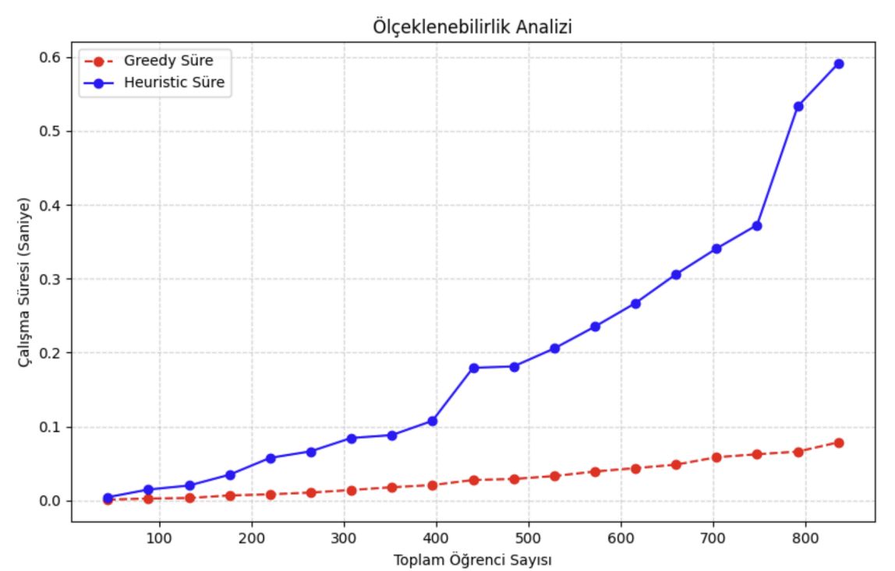
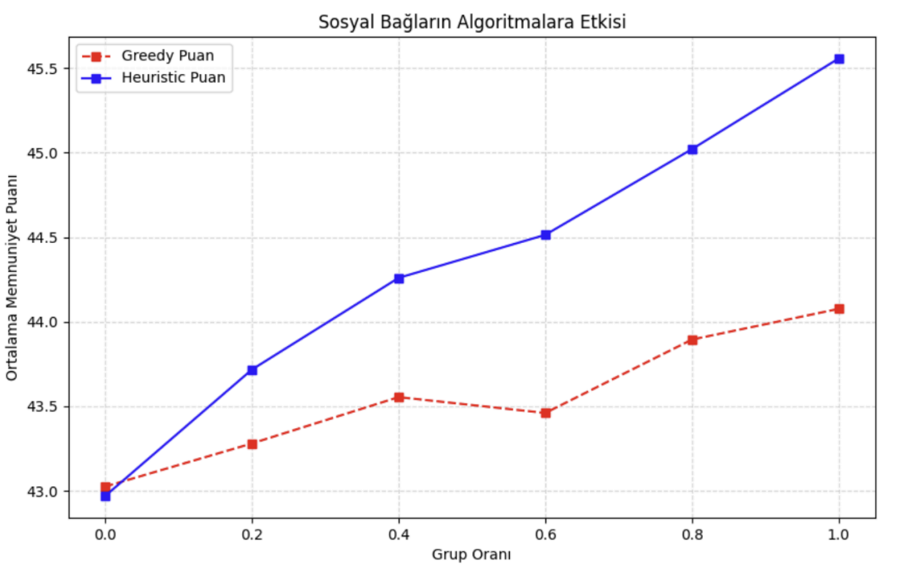
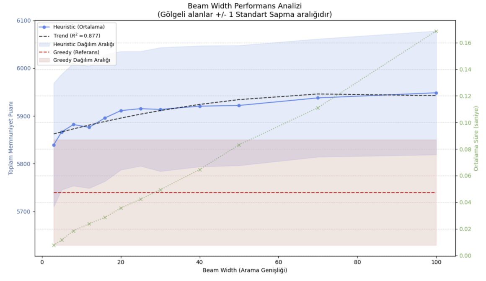
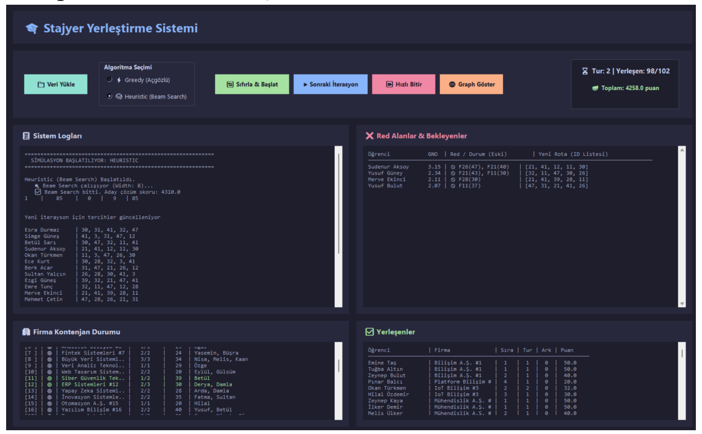
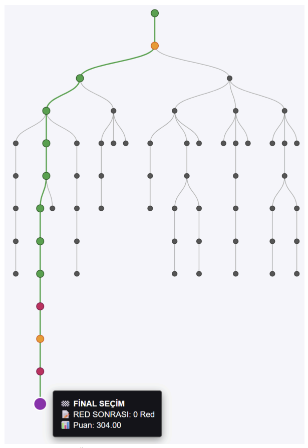

# 🎓 Stajyer Yerleştirme Simülatörü

> **Greedy ve Beam Search Tabanlı Heuristic Yaklaşımların Karşılaştırmalı Analizi**

**Bursa Teknik Üniversitesi – Bilgisayar Mühendisliği**  
Sudenur Elmas · Hasna Şahinoğlu

---

## 📋 İçindekiler

- [Proje Hakkında](#-proje-hakkında)
- [Özellikler](#-özellikler)
- [Kurulum](#-kurulum)
- [Kullanım](#-kullanım)
- [Algoritma Açıklaması](#-algoritma-açıklaması)
  - [Heuristic (Beam Search) Algoritma](#heuristic-beam-search-algoritma)
- [Problem Modeli](#-problem-modeli)
  - [Memnuniyet Skoru Fonksiyonu](#memnuniyet-skoru-fonksiyonu)
  - [Firma Değerlendirme ve Red Mekanizması](#firma-değerlendirme-ve-red-mekanizması)
- [Deneysel Sonuçlar](#-deneysel-sonuçlar)
- [GUI ve Görselleştirme](#-gui-ve-görselleştirme)
- [Proje Yapısı](#-proje-yapısı)

---

## 🔍 Proje Hakkında

Bu proje, stajyer yerleştirme problemini iki farklı algoritmik yaklaşımla ele almakta ve bu yaklaşımları karşılaştırmalı olarak incelemektedir. Gerçek dünya staj koordinasyon sistemlerinin temel dinamiklerini yansıtan bu simülatör; kısıtlı kontenjanlar altında öğrenci-firma eşleştirmesini, firma red süreçlerini ve iteratif yeniden atama mekanizmalarını modellemektedir.

Projenin ayırt edici özelliği, yerleştirme kararlarında **sosyal faktörlerin** (arkadaş grupları, arkadaşlık toleransı) dikkate alınmasıdır. Bu yaklaşım, problemi tekdüze bir tercih-kontenjan eşleştirmesinin ötesine taşıyarak çok kriterli bir optimizasyon problemi haline getirmektedir.

### Temel Hedefler

- Sistem genelinde **toplam memnuniyet skorunun** maksimize edilmesi
- Bireysel tercihler ve sosyal bağların **dengeli** biçimde optimize edilmesi
- İki farklı algoritmanın **karşılaştırmalı analizi**

---

## ✨ Özellikler

- ✅ **İki farklı algoritma**: Greedy ve Beam Search tabanlı Heuristic
- 👫 **Sosyal faktör optimizasyonu**: Arkadaş grupları ve tolerans parametresi
- 🔄 **İteratif yerleştirme**: Dinamik red ve tercih güncelleme mekanizması
- 📊 **Karşılaştırmalı analiz**: Ölçeklenebilirlik, sosyal etki ve Beam Width grafikleri
- 🖥️ **Tkinter GUI**: Koyu tema destekli, adım adım interaktif simülasyon arayüzü
- 🌐 **D3.js görselleştirme**: Beam Search karar ağacının web tabanlı görselleştirilmesi
- 📈 **Otomatik veri üretimi**: Tekrarlanabilir deney senaryoları

---

## ⚙️ Kurulum

### Gereksinimler

- Python 3.8 veya üzeri
- Aşağıdaki Python kütüphaneleri:

```bash
pip install tkinter matplotlib numpy
```

> **Not:** `tkinter` genellikle Python ile birlikte gelir. Eğer sisteminizde yoksa:
>
> ```bash
> # Ubuntu/Debian
> sudo apt-get install python3-tk
>
> # macOS (Homebrew)
> brew install python-tk
> ```

### Kurulum Adımları

```bash
# 1. Depoyu klonlayın
git clone https://github.com/hasnasahinoglu/heuristic_yaklasimla_stajyer_yerlestirme_simulatoru.git
veya
git clone https://github.com/sdnrelms/heuristic_yaklasimla_stajyer_yerlestirme_simulatoru.git

# 2. Proje klasörüne gidin
cd heuristic_yaklasimla_stajyer_yerlestirme_simulatoru

# 4. Uygulamayı çalıştırın
python main.py
```

---

## 🚀 Kullanım

### GUI ile Kullanım (Önerilen)

```bash
python main.py
```

Uygulama başladığında:

1. **Algoritma Seç**: `Greedy` veya `Heuristic (Beam Search)` seçeneklerinden birini belirleyin.
2. **Veri Üret**: "Veri Üret" butonuna tıklayarak rastgele senaryo oluşturun.
3. **Simülasyonu Başlat**:
   - `Adım Adım İlerlet` → Her iterasyonu manuel olarak inceleyin.
   - `Hızlı Bitir` → Simülasyonu otomatik tamamlayın.
4. **Sonuçları İncele**: Log paneli, firma durumu ve öğrenci panellerinden sonuçları takip edin.
5. **Beam Search Ağacı** (yalnızca Heuristic modda): "Graph Göster" butonuyla D3.js ağaç görselleştirmesini açın.

---

## 🧠 Algoritma Açıklaması

### Heuristic (Beam Search) Algoritma

Birden fazla olası yerleştirme senaryosunu (state) eş zamanlı değerlendiren sezgisel bir arama yöntemidir.

```
1. Tek başlangıç state'i ile başlat
2. Öğrencileri GNO'ya göre sırala
3. Beam Search döngüsü:
   a. Her state için genişletme fonksiyonunu çalıştır
   b. Arkadaşlık toleransı aralığında uygun firmalar için ayrı state üret
   c. Her state için sezgisel skoru hesapla (tercih + arkadaş bonusu)
   d. Yalnızca en iyi B adet state'i koru (beam pruning)
4. En yüksek skora sahip state'i seç
5. Seçilen state için gerçek yerleştirme modülünü çalıştır
6. Tercih güncelleme modülünü çalıştır
7. Yerleşmemiş öğrenci kalmayıncaya kadar tekrarla
```

**Güçlü Yönleri:**

- Arkadaşlık bilgisini doğrudan karar sürecine dahil eder
- Çözüm uzayını daha geniş araştırır
- Sosyal faktörlerin yoğun olduğu senaryolarda belirgin üstünlük sağlar

**Sınırlılıkları:**

- Daha yüksek hesaplama maliyeti: `O(I × B × P)`
- Beam Width parametresine duyarlı; dikkatli ayar gerektirir

#### Beam Width Etkisi

| Beam Width | Çözüm Kalitesi     | Hesaplama Süresi |
| ---------- | ------------------ | ---------------- |
| 1          | Greedy'ye yakın    | Çok düşük        |
| 5–10       | Orta               | Düşük            |
| 20–40      | **Optimum aralık** | Orta             |
| 40+        | Marjinal artış     | Yüksek           |

> **Öneri:** Test edilen senaryo boyutları için `beam_width = 20–40` değerleri optimum noktayı temsil etmektedir.

---

## 📐 Problem Modeli

### Memnuniyet Skoru Fonksiyonu

Her öğrencinin memnuniyeti iki bileşenden oluşur:

```
S(i) = P_tercih(s, t) + P_arkadaş(i, k)
```

#### Tercih Puanı

```
P_tercih(s, t) = W_tercih × (MAX_tercih + 1 - s) × (1 - α)^(t-1)
```

| Parametre    | Değer | Açıklama                      |
| ------------ | ----- | ----------------------------- |
| `W_tercih`   | 10    | Ağırlık katsayısı             |
| `MAX_tercih` | 5     | Maksimum tercih sayısı        |
| `α`          | 0.20  | Zamana bağlı azalma katsayısı |

**Örnek:** 1. tercihine 1. turda yerleşen öğrenci → **50 puan**; 2. turda → **40 puan**

#### Arkadaş Bonus Sistemi

```
         ┌ k × 10                                           (s = 1 için)
P_arkaş =│
         └ (s-1) × 10 × (0.8)^(t-1) × min(k,1)
           + (k-1) × 10 × min(k,1)                         (s > 1 için)
```

### Firma Değerlendirme ve Red Mekanizması

Her iterasyonda atanan öğrenciler için değerlendirme skoru hesaplanır:

```
Skor_ij = 0.5 × (GNO_i × 25) + 0.5 × Random(0, 100)
```

- `Skor ≥ Eşik` → Öğrenci kalıcı olarak kabul edilir.
- `Skor < Eşik` → Öğrenci reddedilir, firma ve mülakat puanı "red listesi"ne eklenir.

---

## 📊 Deneysel Sonuçlar

Tüm deneyler **50 bağımsız tekrar** ile gerçekleştirilmiş; sonuçlar ortalama değerler üzerinden raporlanmıştır.

### Senaryo 1: Ölçeklenebilirlik (Öğrenci Sayısı – Süre)

- **Greedy**: Öğrenci sayısı arttıkça çalışma süresi düzenli ve öngörülebilir biçimde yükselir.
- **Heuristic**: Beam Search'ün paralel state değerlendirmesi nedeniyle çalışma süresi daha hızlı artar.

**Sonuç:** Greedy büyük ölçekli senaryolarda hız avantajı sunar; Heuristic çözüm kalitesi için ek hesaplama maliyetini göze alır.



### Senaryo 2: Sosyal Etki (Grup Oranı – Ortalama Memnuniyet)

- **Greedy**: Grup oranı arttıkça memnuniyet puanı sınırlı bir artış gösterir. Sosyal bilgi yerleştirme kararlarını etkilemez.
- **Heuristic**: Grup oranıyla paralel olarak belirgin ve tutarlı memnuniyet artışı gözlemlenir.

**Sonuç:** Sosyal faktörlerin güçlü olduğu ortamlarda Heuristic yaklaşım belirgin üstünlük sağlar.



### Senaryo 3: Beam Width – Toplam Memnuniyet

- Beam Width arttıkça toplam memnuniyet skoru yükselir.
- `BW = 40` sonrasında anlamlı bir artış gözlemlenmez.
- **Optimum aralık: `20–40`**

## 

## 🖥️ GUI ve Görselleştirme

### Tkinter Arayüzü

| Panel                         | İçerik                                                                      |
| ----------------------------- | --------------------------------------------------------------------------- |
| **Kontrol Paneli**            | Algoritma seçimi, adım adım / hızlı ilerleme, anlık durum göstergesi        |
| **Sistem Logları**            | Algoritma kararları, tercih güncellemeleri, iterasyon bilgisi               |
| **Firma Kontenjan Durumu**    | Doluluk oranları, eşik değerleri (yeşil: müsait, gri: dolu)                 |
| **Red Alanlar & Bekleyenler** | Reddedilen öğrenciler ve güncel red tercih listesi                          |
| **Yerleşenler**               | Kalıcı atamalar: iterasyon, tercih sırası, memnuniyet puanı, arkadaş sayısı |



### D3.js Beam Search Ağaç Görselleştirmesi

Heuristic algoritmanın karar uzayını web tabanlı olarak görselleştirir. `generate_html_graph()` fonksiyonu simülasyon sonunda bir `.html` dosyası üretir.

**Görsel Öğeler:**

- 🟢 **Yeşil düğüm**: Kazanan yol (winning path)
- ⚫ **Gri düğüm**: Budanan dallar (pruned states)
- 🟣 **Mor düğüm**: Final seçimi
- 🔴 **Kırmızı düğüm**: Red sonrası
- 🟠 **Turuncu düğüm**: Tur başlangıcı
- 💬 **Tooltip**: Fare ile üzerine gelindiğinde anlık skor ve log detayı

## 

## 📁 Proje Yapısı

```
stajyer-yerlestirme-simulatoru/
│
├── src/
│   ├── beam_width_graph.py
│   ├── controller.py
│   ├── controller_test.py
│   ├── gui.py
│   ├── main.py
│   ├── models.py
│   ├── scalable_social_impact_graph.py
│   ├── scoring.py
│   ├── settings.py
│   ├── utils.py
│   └── data_create.py
├── data/
│   ├── data_example1.json
│   ├── data_example2.json
│   └── beam_simulation_example.html
├──stajyer_yerlestirme_makale.pdf
├──stajyer_yerlestirme_sunum.pdf
└──README.md
```

<div align="center">

**Bursa Teknik Üniversitesi – Bilgisayar Mühendisliği**  
_Algoritmik Yerleştirme ve Optimizasyon Araştırması · 2025–2026_

</div>
